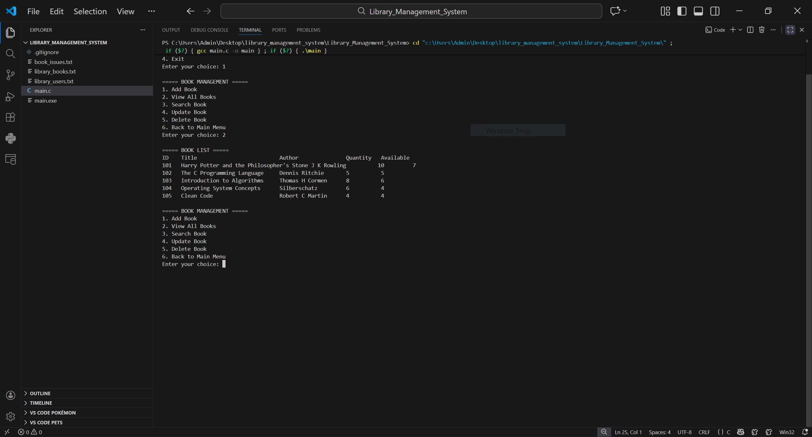

# 📚 Library Management System (C)

A **console-based Library Management System** written in **C**, designed to manage books, users, and book issue/return operations using **file handling** for data persistence.

This project demonstrates strong fundamentals of **C programming**, **data structures**, **file I/O**, and **menu-driven application design**.

---

##Demo



## ✨ Features

### 📖 Book Management

* Add new books
* View all books
* Search books by:

  * ID
  * Title
  * Author
* Update book details
* Delete books (only if no copies are issued)

### 👤 User Management

* Add users
* View all registered users

### 🔄 Issue & Return Management

* Issue books to users
* Prevent issuing unavailable books
* Prevent duplicate issues to the same user
* Return books with return date
* View all issued books with user & book details

### 💾 Data Persistence

All data is stored using text files:

* `library_books.txt`
* `library_users.txt`
* `book_issues.txt`

Data is automatically:

* Loaded on program start
* Saved after every operation

---

## 🛠️ Technologies Used

* **Language:** C
* **Concepts:**

  * Structures
  * Arrays
  * File Handling
  * Input Validation
  * Menu-driven programming

---

## 📂 Project Structure

```
Library_Management_System/
│
├── main.c
├── library_books.txt
├── library_users.txt
├── book_issues.txt
└── .gitignore
```

---

## ▶️ How to Compile & Run

### 🔹 Using GCC

```bash
gcc main.c -o library
```

Run the program:

```bash
./library
```

(On Windows)

```bash
library.exe
```

---

## 🧠 Key Highlights

* Safe input handling using custom helper functions
* Prevents invalid operations (like issuing unavailable books)
* Clean separation of functionality using modular functions
* Uses `.gitignore` to avoid pushing compiled files
* Handles edge cases like empty records and invalid IDs

---

## 🚀 Future Improvements

* Password-based user authentication
* Admin & student roles
* Fine calculation for late returns
* Binary file storage for better performance
* Case-insensitive search
* Date validation

---

## 👨‍💻 Author

**Aditya Bhardwaj**
B.Tech (CSE)

---

## 📜 License

This project is created for **educational purposes**. Feel free to fork, modify, and learn from it.

